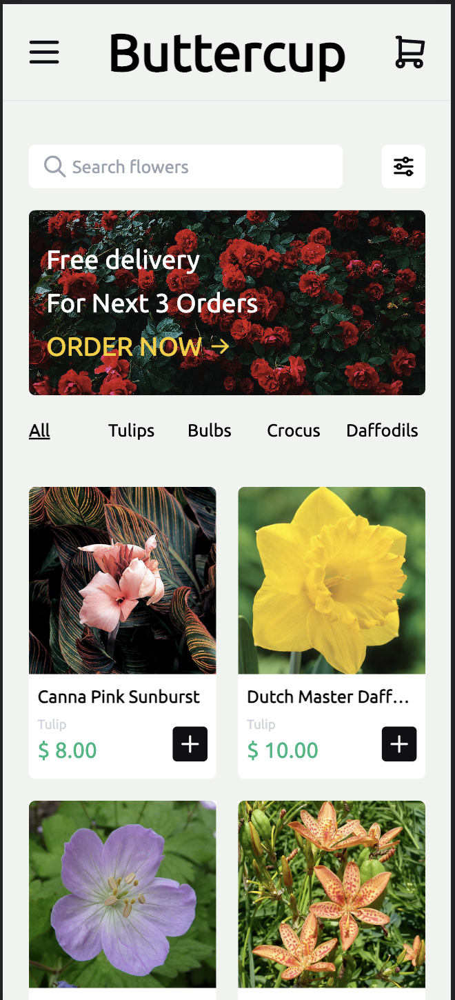
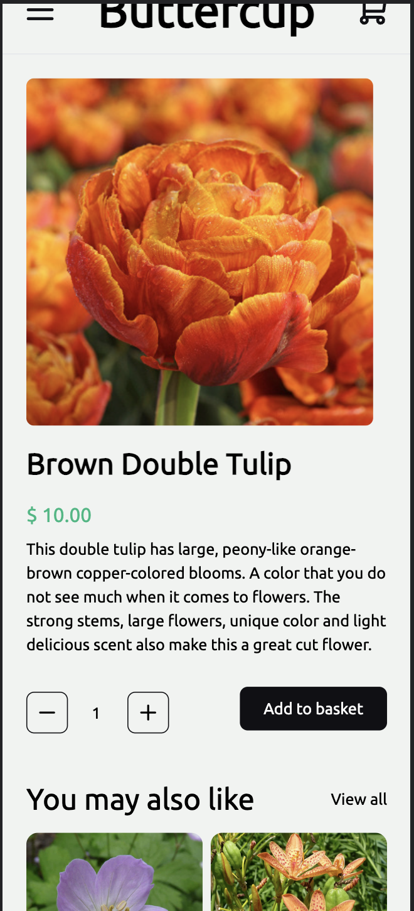
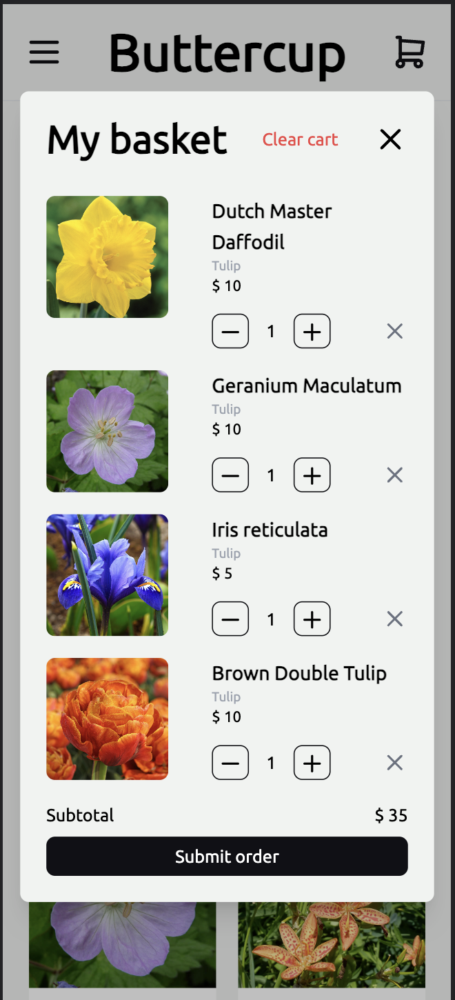
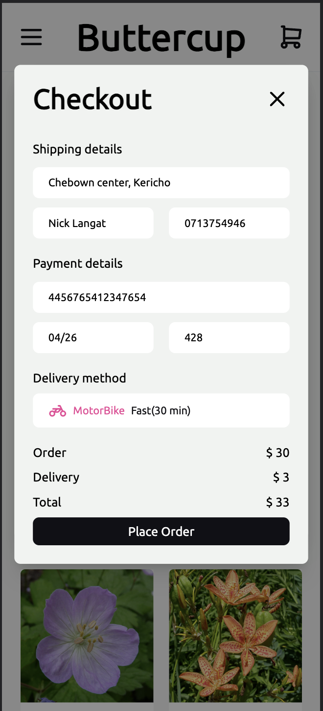
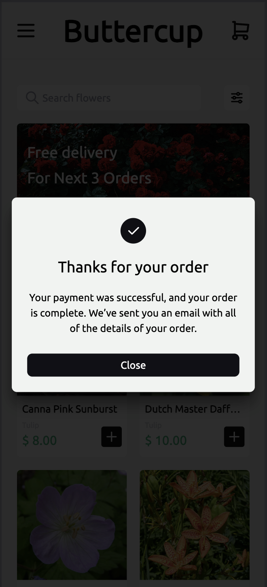
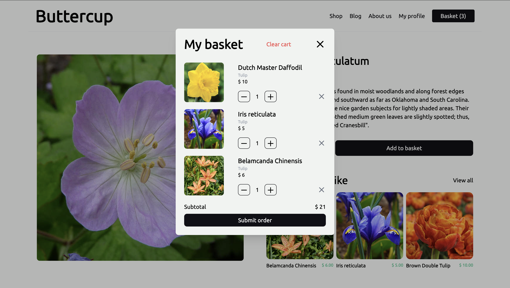
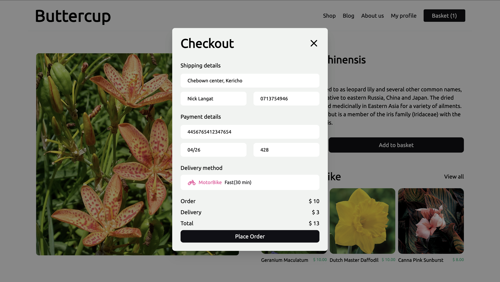
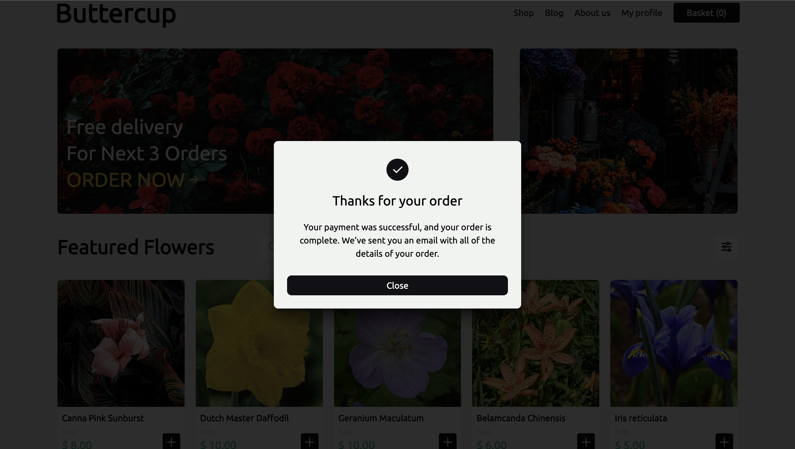

# Buttercup

## MOBILE APP SCREENS
<p align="start">
  
  
  
   
   
  
</p>

## DESKTOP APP SCREENS
<p align="start">
  
  
  
   
</p>

## PROJECT BRIEF
Buttercup is an online e-commerce shop that stocks a wide variety of flowers. As a user, you are welcome to view flower catalog, individual flower detail, add flowers to your basket, place an order and schedule delivery and pick up of ordered flowers. This repo houses all the client related code written in JavaScript, Vue Js and Tailwind CSS.

The backend part of this project is found [in this repo](https://github.com/nicksonlangat/buttercup_api.git/) and is written using Django, DRF, PostgreSQL and containerised using Docker.
The live demo of this project is accessible [via this link](http://localhost:8080/) so go ahead and try it out.

## FEATURES
- **Responsiveness**. This project can be viewed both on desktop browsers and mobile browsers and will adapt accordingly giving the user a smooth shopping experience.
- **List page**. This page displays all flowers in the database that potential buyers can browse through in search for what they need.
- **Detail page**. Each individual flower has a dedicated page with full information regarding it and call to action buttons.
- **Search input**. This functionality is handy when a potential buyer is looking for a specific flower and saves time used in browsing through the list page.
- **Shopping cart**. This is acts as a basket that the users add flowers that they would like to order.
- **Register & Login pages**. These pages allow users to create user accounts that they can use to place orders.

## CHANGELOG

### Version 1.0.2
#### New Features
- Improved most of the existing features.
#### Bug fixes
-No bug fixes in this release

### Version 1.0.1
#### New Features
- Added logic to fetch flowers from the backend
- Added logic to fetch and view an individual flower from the backend
- Added ability to add flowers to the cart
- Added ability to edit flower quantity in the cart
#### Bug fixes
-No bug fixes in this release

### Version 1.0.0
#### New Features
- Added the product list page
- Made the product list page mobile responsive
- Added product detail page
- Made product detail page mobile responsive
- Added main navigation
- Made main navigation mobile responsive
- Added registration page
- Made registration page mobile responsive
- Added login page
- Made login page mobile responsive
#### Bug fixes
-No bug fixes in this release

## LOCAL DEV INSTALLATION
Follow the following commands in the directory you want to run the project in.
```
git clone https://github.com:nicksonlangat/buttercup.git
```
```
cd buttercup
```
```
npm install
```
```
npm run serve
```
Visit http://localhost:8080/ to view the project.
